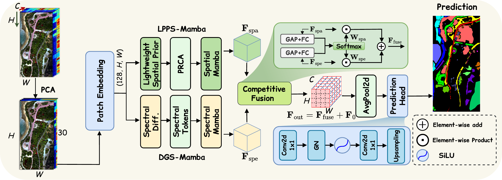

# PyS2CF-Mamba

Official PyTorch implementation of **PyS²CF-Mamba: A Pyramid Spatial--Spectral Competitive Fusion Mamba Network for Hyperspectral Image Classification**, accepted for publication in *IEEE Geoscience and Remote Sensing Letters*.

PyS²CF-Mamba 是一个用于高光谱图像分类的空间–光谱双分支 Mamba 网络。

**Yinping Gao¹, Jiaxin Li¹ (Member, IEEE), Yong Wu¹, Liping Zhang¹, Dajiang Lei¹, Lingyan Kong², and Linfeng Yue²**

**Corresponding author / 通讯作者：Jiaxin Li**

¹ School of Computer Science and Technology (National Exemplary Software School), Chongqing University of Posts and Telecommunications, Chongqing 400065, China; Key Laboratory of Big Data Intelligent Computing, Chongqing University of Posts and Telecommunications.

¹ 重庆邮电大学计算机科学与技术学院（示范性软件学院）、大数据智能计算重点实验室。

² Beijing Institute of Surveying and Mapping; Beijing Key Laboratory of Urban Spatial Intelligent Sensing and Digital Governance.

² 北京市测绘设计研究院、城市空间智能感知与数字治理北京市重点实验室。

# 代码解析 👇 有助你读懂代码 便于复现



**Fig. 1.** Overall architecture of the proposed PyS²CF-Mamba. 本文提出的 PyS²CF-Mamba 总体架构。

输入高光谱图像首先经过高斯平滑、PCA 和百分位拉伸，然后映射到统一的潜在特征空间。LPPS-Mamba 分支提取空间特征，DGS-Mamba 分支提取光谱特征；两个分支通过逐通道竞争融合得到互补的空间–光谱特征，最后由分类头生成整幅分类图。

The preprocessed HSI is projected into a shared latent space. LPPS-Mamba extracts spatial features, DGS-Mamba extracts spectral features, and channel-wise competitive fusion combines both branches before dense classification.

## 文件结构 Directory structure

```text
PyS2CF-Mamba/
├── configs/
│   ├── longkou.json
│   ├── qingyun.json
│   └── tangdaowan.json
├── data/
│   ├── LongKou/
│   ├── QUH-Qingyun/
│   └── QUH-Tangdaowan/
├── docs/
│   └── figures/
│       └── overall_architecture.png
├── models/
│   ├── __init__.py
│   └── pys2cf_mamba.py
├── pys2cf/
│   ├── __init__.py
│   ├── data.py
│   ├── engine.py
│   ├── metrics.py
│   └── reproducibility.py
├── evaluate.py
├── requirements.txt
└── train.py
```

### configs

这个文件夹存放三个数据集的实验配置。数据路径、样本数量、预处理参数、模型参数和训练参数均在对应的 JSON 文件中设置。

This folder contains the experiment configurations for the three datasets.

- `longkou.json`: WHU-Hi-LongKou 配置。
- `qingyun.json`: QUH-Qingyun 配置。
- `tangdaowan.json`: QUH-Tangdaowan 配置。

### data

这个文件夹用于存放原始高光谱图像和对应的真实标签。代码读取原始 `.mat` 文件，并在每次实验中根据随机种子生成训练、验证和测试样本。

This folder stores the original HSI cubes and ground-truth labels. Dataset splits are generated from the original labels for every seed.

### models

- `__init__.py`: exports `PyS2CFMamba`. 导出完整模型。
- `pys2cf_mamba.py`: implements the complete network. 实现完整网络及以下核心模块：
  - `LightweightSpatialPrior`: 使用深度卷积和空间门控提取局部空间先验。
  - `PyramidRefinedChannelAttention`: 在原尺度、1/2 尺度和 1/4 尺度进行通道注意力建模。
  - `LPPSMamba`: 依次执行 LSP、PRCA 和空间 Mamba 扫描。
  - `DGSMamba`: 对潜在特征通道进行一阶差分增强，再执行分组光谱 Mamba 扫描。
  - `ChannelWiseCompetitiveFusion`: 对两个分支逐通道计算 Softmax 权重并进行竞争融合。
  - `PyS2CFMamba`: 连接输入映射、双分支骨干、残差连接、平均池化和分类头。

### pys2cf

- `data.py`: reads `.mat` files, preprocesses the HSI, and generates deterministic splits. 负责数据读取、预处理和样本划分。
- `engine.py`: performs overlapping-tile training and inference. 负责重叠分块训练、梯度更新和整图推理。
- `metrics.py`: calculates OA, AA, Kappa, per-class accuracy, and the confusion matrix. 计算分类指标。
- `reproducibility.py`: sets random seeds and reads/writes JSON files. 设置随机种子并读写结果文件。

### train / evaluate

- `train.py`: training, validation, best-checkpoint selection, testing, and ten-run summary. 完成训练、验证、最佳权重选择、测试和多次实验汇总。
- `evaluate.py`: evaluates a saved `best.pt` with its saved preprocessing state and test split. 使用已保存的预处理参数和测试划分重新评估模型。

## 如何运行我们的代码 How to run our code

### Requirements

The reference environment is Python 3.11, PyTorch 2.10.0, CUDA 13.0, and `mamba-ssm` 2.3.1. The official Mamba kernels require a CUDA GPU.

参考环境为 Python 3.11、PyTorch 2.10.0、CUDA 13.0 和 `mamba-ssm` 2.3.1。官方 Mamba 算子需要 CUDA GPU。

```bash
conda create -n pys2cf python=3.11 -y
conda activate pys2cf
pip install torch==2.10.0
pip install -r requirements.txt
```

如果 `mamba-ssm` 需要根据当前 PyTorch 和 CUDA 环境编译，可使用：

```bash
pip install --no-build-isolation mamba-ssm==2.3.1
```

### Data

请将数据文件放在以下位置，目录名、文件名和 `.mat` 变量名需要与代码保持一致。

Place the original datasets under `data/` using the following directory and file names:

```text
data/
├── LongKou/
│   ├── WHU_Hi_LongKou.mat
│   └── WHU_Hi_LongKou_gt.mat
├── QUH-Qingyun/
│   ├── QUH-Qingyun.mat
│   └── QUH-Qingyun_GT.mat
└── QUH-Tangdaowan/
    ├── QUH-Tangdaowan.mat
    └── QUH-Tangdaowan_GT.mat
```

| Dataset | HSI variable | Label variable |
| --- | --- | --- |
| WHU-Hi-LongKou | `WHU_Hi_LongKou` | `WHU_Hi_LongKou_gt` |
| QUH-Qingyun | `Chengqu` | `ChengquGT` |
| QUH-Tangdaowan | `Tangdaowan` | `TangdaowanGT` |

Dataset sources / 数据来源：

- WHU-Hi: <http://rsidea.whu.edu.cn/e-resource_WHUHi_sharing.htm>
- QUH: <https://github.com/Hang-Fu/QUH-classification-dataset>

请遵守原始数据集的使用条款，并引用对应的数据集论文。

Download the datasets from their official sources, then place the `.mat` files in the directory structure shown above. The datasets are not included in this repository.

请从上述官方来源下载数据集，并按照目录结构放置 `.mat` 文件。本仓库不包含数据集文件。

### Parameters

所有实验参数都在 `configs/*.json` 中设置。三个正式配置采用相同的预处理、模型和训练参数，仅数据集名称与每类样本数量不同。

All experiment parameters are defined in `configs/*.json`.

| 参数 / Parameter | 默认设置 / Default |
| --- | --- |
| Gaussian smoothing | `sigma=1.0` |
| PCA | 30 components |
| Percentile stretch | 2%–98%, quantized to `[0, 255]` |
| Hidden dimension | 128 |
| DGS groups / difference coefficient | 4 / 0.5 |
| PRCA scales / layers / heads | 3 / 3 / 4 |
| Optimizer | Adam |
| Learning rate / weight decay | `3e-4` / `1e-5` |
| Epochs / label smoothing | 200 / 0.05 |
| Seeds | 0–9 |
| Tile size / overlap | 512 / 32 |
| Optimizer-update groups | 2 |

训练损失只在训练集标注像素上计算。推理时对重叠区域的 logits 取平均，再生成整幅分类结果。

The loss is computed only at labelled training pixels. During inference, logits in overlapping regions are averaged before producing the full-scene prediction.

每类样本划分如下。每一类先按随机种子独立打乱，前 `K` 个像素用于训练，随后 `V` 个像素用于验证，其余有标签像素用于测试；标签值为 0 的像素不参与实验。

For every class, the first `K` shuffled pixels are used for training, the next `V` for validation, and all remaining labelled pixels for testing.

| Dataset | Classes | Train/class | Validation/class | Test |
| --- | ---: | ---: | ---: | --- |
| WHU-Hi-LongKou | 9 | 30 | 10 | Remaining labelled pixels |
| QUH-Qingyun | 6 | 100 | 30 | Remaining labelled pixels |
| QUH-Tangdaowan | 18 | 100 | 30 | Remaining labelled pixels |

### Run

调整对应配置后，在仓库根目录运行 `train.py`。每条命令会依次执行配置中的 10 个随机种子。

Run `train.py` from the repository root after selecting the corresponding configuration:

```bash
CUDA_VISIBLE_DEVICES=0 python train.py --config configs/longkou.json
CUDA_VISIBLE_DEVICES=0 python train.py --config configs/qingyun.json
CUDA_VISIBLE_DEVICES=0 python train.py --config configs/tangdaowan.json
```

如需指定其他 CUDA 设备，也可以直接使用 `--device cuda:1`。

### Results

运行 `train.py` 后，结果默认保存在 `outputs/<dataset>/` 中。例如，LongKou 的第一个随机种子保存在 `outputs/LongKou/run0_seed0/`。

```text
outputs/<dataset>/
├── preprocessing.npz
├── resolved_config.json
├── summary.json
├── train.log
└── run<i>_seed<s>/
    ├── best.pt
    ├── metrics.json
    ├── prediction.npy
    └── split.npz
```

- `preprocessing.npz`: 保存 PCA、百分位拉伸和高斯平滑参数，供 `evaluate.py` 复用。
- `resolved_config.json`: 保存本次训练实际使用的配置。
- `train.log`: 记录每轮损失、验证指标和最终测试指标。
- `summary.json`: 保存所有随机种子的结果，以及测试 OA、AA 和 Kappa 的均值与标准差。
- `best.pt`: 保存验证集 OA 最优的模型参数。
- `metrics.json`: 保存单次实验的最佳轮次、验证/测试指标、训练/测试时间和参数量。
- `prediction.npy`: 保存整幅分类结果，类别编号为 `0` 至 `C-1`。
- `split.npz`: 保存当前实验的 `train_idx`、`val_idx` 和 `test_idx`。

The original ground truth uses `1` to `C` for classes and `0` for unlabelled pixels. `prediction.npy` uses zero-based class indices. Metrics are saved as values between 0 and 1.

原始标签使用 `1` 至 `C` 表示类别，使用 `0` 表示未标注像素；`prediction.npy` 使用从 0 开始的类别编号。测试指标只在测试集标注像素上计算，并在 JSON 中以 0 至 1 的小数保存。

### Evaluate a saved checkpoint

评估时请使用训练输出目录中的 `resolved_config.json`，并保留原始输出目录结构，使程序能够找到 `preprocessing.npz` 和 `split.npz`。

```bash
CUDA_VISIBLE_DEVICES=0 python evaluate.py \
  --config outputs/LongKou/resolved_config.json \
  --checkpoint outputs/LongKou/run0_seed0/best.pt
```

程序会在终端输出 OA、AA 和 Kappa，并将完整指标保存为权重目录中的 `evaluation.json`。

## 如何联系我们 Contact

If you encounter any problems with the code, data processing, or result reproduction, please contact us.

如果在代码调试、数据处理或结果复现过程中遇到问题，欢迎通过邮箱联系我们：

- Yinping Gao (first author / 第一作者): [2023214358@stu.cqupt.edu.cn](mailto:2023214358@stu.cqupt.edu.cn)
- Jiaxin Li (corresponding author / 通讯作者): [lijiaxin203@mails.ucas.ac.cn](mailto:lijiaxin203@mails.ucas.ac.cn)

## Citation

If this code is useful for your research, please cite the accepted PyS²CF-Mamba manuscript. The paper is currently in press; its DOI, volume, issue, year, and page numbers will be added after online publication. Citation metadata is provided in [CITATION.cff](CITATION.cff).

如果本项目对你的研究有帮助，请引用已接收的 PyS²CF-Mamba 论文。论文目前尚未正式见刊，DOI、卷期、年份和页码将在在线发表后补充。引用信息见 [CITATION.cff](CITATION.cff)。

## License

The code is released under the [MIT License](LICENSE). The datasets remain subject to their original licenses and terms of use.

代码采用 MIT 许可证；数据集仍遵循各自的原始许可和使用条款。
